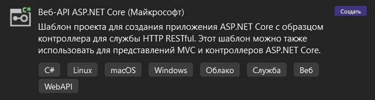
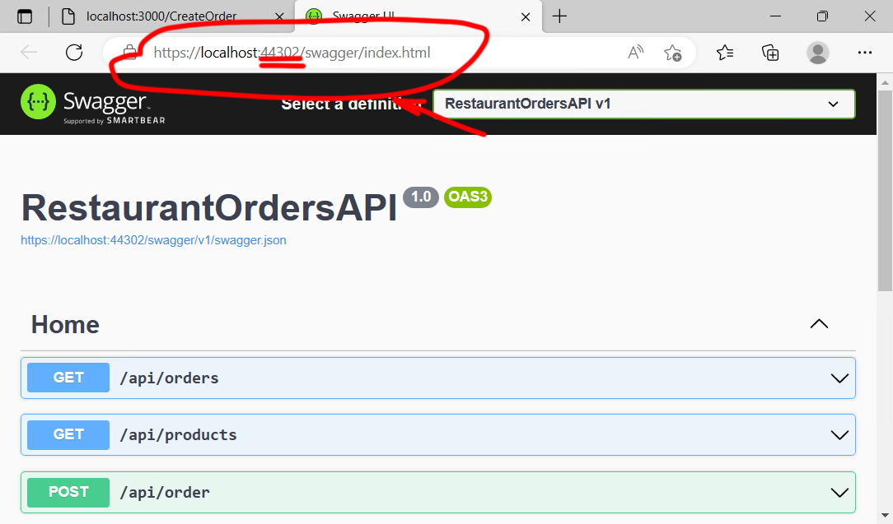
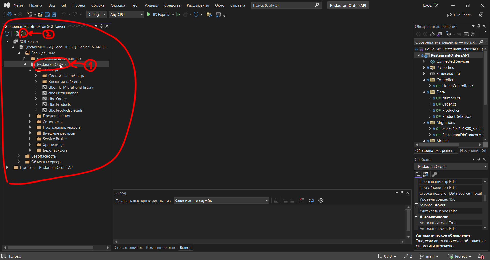
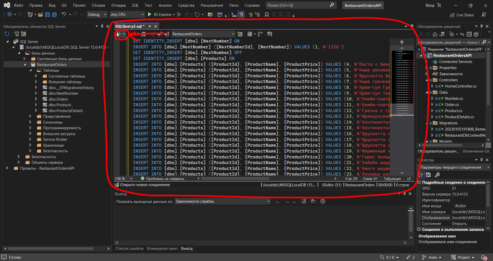

# Сайт для создания заказов в ресторане

* [О проекте](#AboutProject)
* [Используемые технологии](#TechnologiesUsed)
  * [Серверная часть](#ServerSide)
  * [Клиентская часть](#ClientSide)
* [Настройка окружения разработки](#SettingDevelopmentEnvironment)
  * [Загрузка проекта](#LoadProject)
  * [Настройка Visual Studio](#VisualStudioSetup)
  * [Настройка React](#SettingReact)
  * [Настройка проекта (может не понадобиться)](#ProjectSetup)
  * [Подключение базы данных (не обязательно)](#DatabaseConnection)

## О проекте

Сайт на котором можно создавать заказы.  
  
У заказа есть уникальный номер, общая стоимость и способ оплаты, который можно выбрать вручную. При создании выпадает список с товарами в магазине. У товаров есть поиск. Каждый товар можно перенести в заказ. При переносе товара, у него появляется счетчик, в котором указывается количество товара. При нажатии кнопки "Сохранить", будет создан новый заказ. При нажатии кнопки "Очистить", все товары будут перемещены обратно в список товаров.  
  
Созданные заказы можно посмотреть в разделе с заказами. В заказах есть номер, способ оплаты, общая стоимость и список товаров. Каждый заказ можно удалить.  

## Используемые технологии

### Серверная часть

Для разработки серверной части использовался язык программирования C#. При создании проекта был выбран шаблон "Веб-API ASP.NET Core".  
  
Для работы с базой данных в проекте используется Entity Framework Core. Чтобы EF Core работал в приложении, при помощи пакетного менеджера "NuGet" были установлены следующие библиотеки
 - Microsoft.EntityFrameworkCore
 - Microsoft.EntityFrameworkCore.Design
 - Microsoft.EntityFrameworkCore.SqlServer
 - Microsoft.EntityFrameworkCore.Tools

### Клиентская часть

Для разработки клиентской части использовалась JavaScript-библиотека React. Связь с сервером осуществляется при помощи библиотеки Axios. Для создания маршрутов в веб приложении используется библиотека маршрутизации React Router Dom

## Настройка окружения разработки для Windows

### Загрузка проекта

1. Зайдите в проект на GitHub (https://github.com/ElkinAndrey/RestaurantOrders)  
2. Нажмите на кнопку "Code"  
3. Нажмите на кнопку "Download ZIP"  
&nbsp;  
4. Распакуйте скачанный файл  

### Настройка Visual Studio

Если Visual Studio 2022 Community уже установлена, то запустите Visual Studio, нажмите "Средства" в верхнем меню. В открывшемся меню нажмите "Получить средства и компоненты...". После этого перейдите к шагу 4.
&nbsp;  
1. Скачайте Visual Studio 2022 Community с официального сайта (VS 2022 или выше) (https://visualstudio.microsoft.com/ru/downloads/)  
2. Запустите скачанный установочный файл  
3. Нажимайте "продолжить", пока не появится окно установки  
&nbsp;  
4. В окне установки поставьте галочки у нужных инструментов  
4.1. ASP.NET и разработка веб-приложений  
&nbsp;  
5. Нажмите кнопку "Установить"  
6. После установки Visual Studio, откройте папку со скачанным проектом, Перейдите по пути "RestaurantOrders\RestaurantOrdersAPI" и запустите файл "RestaurantOrdersAPI.sln" при помощи Visual Studio  
7. После запуска Visual Studio, нажмите на стрелочку возле кнопки запуска проекта  
8. В открывшемся меню, выберите пункт "IIS Express"  
9. Нажмите на кнопку запуска  
&nbsp;  
10. Если после этого запустилось окно с логотипом "Swagger", то все сделано верно

### Настройка React

1. Скачайте Node JS с официального сайта (https://nodejs.org/ru/download/)  
2. Откройте "Командную строку"  
2.1. Нажмите сочетание клавиш "Win + R"  
2.2. В открывшемся окне вбиваете "cmd"  
2.3. Нажимаете кнопку "Ок"  
3. В командной строке перейдите в папку с проектом (Для смены диска введите команду "D:" где D имя диска) (Для перехода по папкам введите команду "cd D:\RestaurantOrders" где D:\RestaurantOrders путь к папке)  
4. В консоли в папке с проектом перейдите в папку "RestaurantOrders\restaurant-orders-app"  
5. После перехода, введите в консоль команду "npm install" для того, чтобы установить в проект все необходимые библиотеки  
6. После установки библиотек, введите в консоль команду "npm start" для того, чтобы запустить проект  

### Настройка проекта (может не понадобиться)  

1. В папке с проектом, перейдите по пути "RestaurantOrders\RestaurantOrdersAPI\RestaurantOrdersAPI" и откройте файл "Program.cs".  
2. Убедитесь, что URL в файле будет совпадать с URL клиентского приложения. Если URL не совпадают, то замените URL в файле "Program.cs", на URL клиентского приложения и сохраните изменения (Посмотрите URL клиентского приложения, открыв страницу на сайте. Обычно URL "http://localhost:3000")  
&nbsp;&nbsp;&nbsp; 
3. В папке с проектом, перейдите по пути "RestaurantOrders\restaurant-orders-app\src\API" и откройте файл "index.js".  
4. Убедитесь, что 5 цифр в URL совпадают с 5 цифрами сервера. Если 5 цифр не совпадают, то замените цифры в файле "index.js", на цифры сервера и сохраните изменения (Посмотрите URL сервера, открыв страницу на сайте. Обычно URL "http://localhost:44302")  
&nbsp;&nbsp;&nbsp;  
5. Если все URL совпадают, то перезапустите проекты (запустить  как в пунктах "[Настройка Visual Studio](#VisualStudioSetup) шаг 9" и "[Настройка React](#SettingReact) шаг 6")  
6. После запуска обоих проектов, откроется сайт, как демонстрируется в разделе [О проекте](#AboutProject)  

### Подключение базы данных (не обязательно)  

Приложение уже работает, но в нем используется фальшивая база данных, которая прописана в коде программы. После закрытия программы, все данные удалятся. Для сохранения данных можно подключить настоящую базу данных.
1. Откройте "Командную строку"  
1.1. Нажмите сочетание клавиш "Win + R"  
1.2. В открывшемся окне вбиваете "cmd"  
1.3. Нажимаете кнопку "Ок"  
2. В командной строке перейдите в папку с проектом (Для смены диска введите команду "D:" где D имя диска) (Для перехода по папкам введите команду "cd D:\RestaurantOrders" где D:\RestaurantOrders путь к папке)  
3. В командной строке в папке с проектом, перейдите по пути "RestaurantOrders\RestaurantOrdersAPI\RestaurantOrdersAPI" в папку с файлом "Program.cs".  
4. В командной строке введите "dotnet tool install --global dotnet-ef --version 7.\*" для установки средств Entity Framework  
5. После установки в командной строке введите "dotnet ef database update" для создания базы данных проекта  
6. После создания базы данных, зайдите в Visual Studio  
7. В Visual Studio в меню сверху, нажмите на кнопку "Вид"  
8. В открывшемся меню, нажмите на кнопку "Обозреватель объектов SQL Server"  
&nbsp;  
9. В "Обозревателе объектов SQL Server" перейдите по пути "SQL Server\(localdb)\MSSQLLocalDB\Базы данных\RestaurantOrders"  
10. Нажмите на базу данных "RestaurantOrders" и нажмите на кнопку "Создать запрос" в верху "Обозревателя объектов SQL Server"  
&nbsp;  
11. В открывшийся файл скопируйте следующий код<pre>
SET IDENTITY_INSERT [dbo].[NextNumber] ON
INSERT INTO [dbo].[NextNumber] ([NextNumberId], [NextNumber]) VALUES (1, N'1326')
SET IDENTITY_INSERT [dbo].[NextNumber] OFF
SET IDENTITY_INSERT [dbo].[Products] ON
INSERT INTO [dbo].[Products] ([ProductId], [ProductName], [ProductPrice]) VALUES (4, N'Паста с беконом и яйцом пашот', CAST(359.10 AS Decimal(18, 2)))
INSERT INTO [dbo].[Products] ([ProductId], [ProductName], [ProductPrice]) VALUES (5, N'Каша рисовая', CAST(159.00 AS Decimal(18, 2)))
INSERT INTO [dbo].[Products] ([ProductId], [ProductName], [ProductPrice]) VALUES (6, N'Брускетта Вегетарианская', CAST(314.10 AS Decimal(18, 2)))
INSERT INTO [dbo].[Products] ([ProductId], [ProductName], [ProductPrice]) VALUES (7, N'Каша гречневая', CAST(159.00 AS Decimal(18, 2)))
INSERT INTO [dbo].[Products] ([ProductId], [ProductName], [ProductPrice]) VALUES (8, N'Крем-суп Грибной', CAST(233.10 AS Decimal(18, 2)))
INSERT INTO [dbo].[Products] ([ProductId], [ProductName], [ProductPrice]) VALUES (9, N'Крем-суп Тыквенный', CAST(233.10 AS Decimal(18, 2)))
INSERT INTO [dbo].[Products] ([ProductId], [ProductName], [ProductPrice]) VALUES (10, N'Комбо-завтрак №2', CAST(357.60 AS Decimal(18, 2)))
INSERT INTO [dbo].[Products] ([ProductId], [ProductName], [ProductPrice]) VALUES (11, N'Комбо-завтрак №1', CAST(469.60 AS Decimal(18, 2)))
INSERT INTO [dbo].[Products] ([ProductId], [ProductName], [ProductPrice]) VALUES (12, N'Гречка с грибами, беконом и яйцом пашот', CAST(329.00 AS Decimal(18, 2)))
INSERT INTO [dbo].[Products] ([ProductId], [ProductName], [ProductPrice]) VALUES (13, N'Французский тост с семгой и авокадо', CAST(459.00 AS Decimal(18, 2)))
INSERT INTO [dbo].[Products] ([ProductId], [ProductName], [ProductPrice]) VALUES (14, N'Континентальный завтрак с окороком', CAST(559.00 AS Decimal(18, 2)))
INSERT INTO [dbo].[Products] ([ProductId], [ProductName], [ProductPrice]) VALUES (15, N'Континентальный завтрак с семгой', CAST(159.00 AS Decimal(18, 2)))
INSERT INTO [dbo].[Products] ([ProductId], [ProductName], [ProductPrice]) VALUES (16, N'Брускетта с авокадо, семгой и яйцом пашот', CAST(429.00 AS Decimal(18, 2)))
INSERT INTO [dbo].[Products] ([ProductId], [ProductName], [ProductPrice]) VALUES (17, N'Брускетта с беконом, скрэмблом и сальсой', CAST(314.10 AS Decimal(18, 2)))
INSERT INTO [dbo].[Products] ([ProductId], [ProductName], [ProductPrice]) VALUES (18, N'Брускетта с окороком и яйцом пашот', CAST(389.00 AS Decimal(18, 2)))
INSERT INTO [dbo].[Products] ([ProductId], [ProductName], [ProductPrice]) VALUES (19, N'Фирменный картофель фри большой', CAST(99.00 AS Decimal(18, 2)))
INSERT INTO [dbo].[Products] ([ProductId], [ProductName], [ProductPrice]) VALUES (20, N'Гирос большой без картофеля фри', CAST(269.10 AS Decimal(18, 2)))
INSERT INTO [dbo].[Products] ([ProductId], [ProductName], [ProductPrice]) VALUES (21, N'Хабиби шаурма хит большая', CAST(269.10 AS Decimal(18, 2)))
INSERT INTO [dbo].[Products] ([ProductId], [ProductName], [ProductPrice]) VALUES (22, N'Амиго шаурма большая средне острая', CAST(269.10 AS Decimal(18, 2)))
INSERT INTO [dbo].[Products] ([ProductId], [ProductName], [ProductPrice]) VALUES (23, N'Луковые кольца', CAST(80.10 AS Decimal(18, 2)))
INSERT INTO [dbo].[Products] ([ProductId], [ProductName], [ProductPrice]) VALUES (24, N'Куриные наггетсы порция', CAST(72.90 AS Decimal(18, 2)))
INSERT INTO [dbo].[Products] ([ProductId], [ProductName], [ProductPrice]) VALUES (25, N'Сырные палочки порция', CAST(162.90 AS Decimal(18, 2)))
INSERT INTO [dbo].[Products] ([ProductId], [ProductName], [ProductPrice]) VALUES (26, N'Амиго шаурма большая средне острая', CAST(269.10 AS Decimal(18, 2)))
INSERT INTO [dbo].[Products] ([ProductId], [ProductName], [ProductPrice]) VALUES (27, N'Гирос большой без картофеля фри', CAST(269.10 AS Decimal(18, 2)))
SET IDENTITY_INSERT [dbo].[Products] OFF
</pre>

12. Нажмите на кнопку "Выполнить"  
&nbsp;  
13. В результате в база данных заполниться товарами   
14. В папке с проектом, перейдите по пути "RestaurantOrders\RestaurantOrdersAPI\RestaurantOrdersAPI" и откройте файл "Program.cs".  
15. В файле найдите надпись "FakeRestaurantRepository" и замените её на "EFRestaurantRepository". После этого сохраните файл и запустите проект  
&nbsp;  
16. После проделанных действий, будет создана и заполнена база данных проекта
